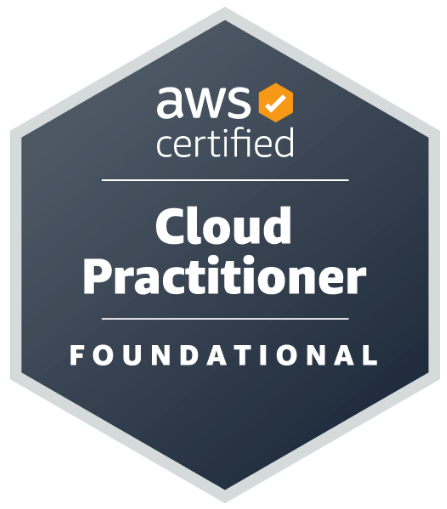
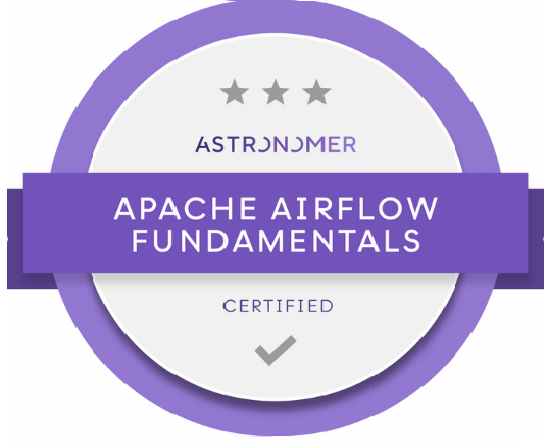

## **Sobre mim:**
Engenheiro de Dados com formação em Sistemas de Informação e uma trajetória de 12 anos no universo dos dados. 
Atualmente trabalhando em ambientes de Big Data, Data Lakehouse e Modern Data Warehouse utitizando Databricks, Pyspark, Python, SQL e recursos da cloud Azure (Synapse, Spark Pool, SQL Serveless, Data Factory, Data Lake Storage Gen2).

Expertise em:  
✔️ Pyspark;  
✔️ Databricks; 
✔️ Python; 
✔️ SQL; 
✔️ Delta Lake; 
✔️ Git (GitHub, BitBucket); 
✔️ Stack BigData Azure (Synapse, Databricks, Data Factory, Azure Devops); 
✔️ Airflow;  

  <a href="https://github.com/phillipefs">
  
  

  
## Certificações:

  
  
  
  
  
  
  

  
## Skills:
### Data Engineering Tools

    
        
    
    
    
     
    
    
    
    

### Databases (SQL/NoSQL)

    
    
    
    
    
    
    

 
## **Contato:**

